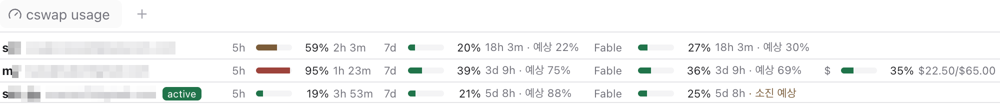

# cswap-usage

[English](README.md)

[claude-swap](https://pypi.org/project/claude-swap/) 계정마다 Claude 사용량을 한 줄씩
보여주는 [Paseo](https://paseo.sh) 워크스페이스 패널.



## 왜 필요한가

Paseo의 사용량 패널은 프로바이더 ID를 정확히 일치시켜 찾는다. 그래서 `extends: "claude"`로
만든 프로바이더에는 사용량 줄이 아예 뜨지 않는다. 기본으로 들어 있는 `claude` 줄 하나는
자격 증명 파일을 딱 하나만 읽으니, 지금 켜져 있는 계정밖에 보여주지 못한다. claude-swap으로
Claude 계정 여러 개를 돌려 쓰고 있다면 이들을 한눈에 볼 방법이 없는 셈이다.

이 패널은 Paseo가 extends 프로바이더의 사용량까지 물려받을 때까지 그 빈자리를 메운다.

## 요구 사항

- Paseo 0.7.2 이상
- 대상 데몬에서 플러그인 활성화(**Settings → Plugins → Enable plugins**)
- [`claude-swap`](https://pypi.org/project/claude-swap/) 설치, `cswap list --json` 이 정상 동작

## 설치

```bash
paseo plugin add creatorKoo/paseo-cswap-usage
```

로컬 체크아웃에서 설치하려면:

```bash
git clone https://github.com/creatorKoo/paseo-cswap-usage
paseo plugin install "$PWD/paseo-cswap-usage"
paseo plugin ls          # expect: cswap-usage  running
```

## 사용법

**⌘K**(윈도우·리눅스는 **Ctrl+K**) → **Open cswap usage** 로 열거나, New tab 메뉴의
*plugin panels* 에서 연다. 평범한 워크스페이스 패널이라 *Split down* 도 되니, 에이전트 아래에
상태 표시줄처럼 붙여 둘 수 있다.

계정 하나가 표의 한 행이다. 행은 줄바꿈되지 않고, 같은 칩은 어느 행에서든 같은 열에 들어간다:

```
skt   you@example.com [active]   5h    ▮▮▮▮ 100% 16m                  7d    ▮▯▯▯  14% 21h 36m · 예상 16%   Fable ▮▯▯▯  19% 21h 36m              $     ▮▮▯▯  35% $22.50/$65.00
alt   me@example.com             5h    ▮▯▯▯  22% 3h 41m               7d    ▮▯▯▯   6% 4d 02h                                                    $     ▯▯▯▯   4% $2.40/$65.00
team  team@example.com           5h    ▮▮▯▯  48% 2h 05m               7d    ▮▮▯▯  51% 3d 11h · 예상 74%    Fable ▮▮▮▯  63% 3d 11h
```

- **별칭**, **이메일**, 그리고 claude-swap이 지금 쓰고 있는 계정에 붙는 `active` 배지
- 창마다 열 하나씩: `5h`, `7d`, `Fable` 같은 범위별 창, 그리고 맨 뒤에 `$` 지출. 어느 계정에도
  없는 창은 열 자체가 생기지 않는다.
- 셀은 모두 `라벨 · 미니 바 · 퍼센트 · 남은 시간` 구성이고, 폭이 고정이라 열이 세로로 맞는다. 해당
  창이 없는 계정은 그 칸이 빈칸으로 남고, 패널이 표보다 좁으면 가로로 스크롤된다.
- 바 색은 accent에서 시작해 50%에 warning, 90%에 danger로 바뀐다
- 푸터의 **A−** / **A+** 는 글자 크기 세 단계(S/M/L)를 돌린다. 패널을 열 때마다 S에서
  다시 시작한다. 플러그인에는 저장소 API가 없다.
- **새로고침**은 말 그대로 다시 가져오기만 한다. 60초 캐시가 살아 있으면 캐시된 값이 그대로 온다.

`예상 N%`는 **선형** 추정이다. `pct / expectedPct`, 즉 지금의 소모 속도가 창이 끝날 때까지
이어진다고 보고 늘려 잡은 값이다. 이 값이 100%를 넘으면 `소진 예상`으로 바뀐다. 몰아 쓰면
크게 흔들리는 값이니 대략적인 신호 정도로만 보면 된다. claude-swap이 사람에게 보여주는
출력에서 이 추정치를 빼 둔 이유이기도 하다. 창이 초기화되고 24시간쯤은 빈칸인데,
claude-swap이 창이 어느 정도 지나기 전에는 `expectedPct`를 내주지 않기 때문이다.

UI 문구는 시스템 로케일을 따른다(한국어 아니면 영어). 스크린샷은 한국어 로케일 화면이다.

계정 상태가 정상이 아니면 사용량 칩 자리에 claude-swap이 준 상태 문자열(`re-login needed`,
`token expired`, `keychain unavailable` 등)이 warning 색으로 들어간다. 이 상태는 매번 다시
계산할 뿐 디스크에는 쓰지 않는다. 이 플러그인이 claude-swap의 캐시 파일을 읽는 대신 굳이
프로세스를 띄우는 이유가 바로 이것이다.

## 동작 방식

`cswap list --json`이 유일한 데이터 출처다. claude-swap의 상태 파일을 읽지 않고, Anthropic
API를 직접 부르지도 않으며, 상태를 바꾸는 claude-swap 명령(`switch`, `auto`)도 실행하지 않는다.
철저히 읽기 전용이다.

데몬 쪽 핸들러는

- **60초** 캐시를 두고 그보다 자주 조회하지 않는다. 사용량 엔드포인트 예산이 아이덴티티당
  시간당 28~30회쯤이고, claude-swap을 쓰는 모든 화면이 이 예산을 나눠 쓴다. 조회가 실제로
  네트워크까지 나가는지는 claude-swap이 정하지 우리가 정하지 않는다.
- **단일 실행(single-flight)** 이다. 동시에 들어온 호출은 서브프로세스 하나를 같이 쓴다.
  두 개가 뜨는 일은 없다.
- **실패해도 이전 값을 유지한다(stale-on-error)**. 호출이 실패하면 직전 스냅샷을 그대로 두고
  오류 줄만 세운다. claude-swap 자신의 동작과 같다.
- 서브프로세스 stdout은 절대 로그에 남기지 않는다. 이메일과 조직 이름이 들어 있다.

패널이 그리지 않는 필드(`organizationName`, `organizationUuid`, `projectedExhaustionAt` 등)는
데몬 쪽 Zod 스키마에서 걸러내므로 클라이언트까지 아예 넘어가지 않는다.

## 설정

`cswap`은 `~/.local/bin/cswap`에서 찾는다. 데몬의 `PATH`는 사용자 셸의 `PATH`와 다르기 때문에,
이름을 `PATH`로 해석하는 일은 아예 하지 않는다. 다른 경로를 쓰려면 `CSWAP_BIN`에 절대 경로를
넣는다:

```bash
CSWAP_BIN=/opt/homebrew/bin/cswap
```

이 변수는 핸들러가 도는 **Paseo 데몬 프로세스**의 환경에 있어야 한다. 셸에서 export 해 봐야
이미 떠 있는 데몬에는 아무 영향이 없다. 데몬을 띄우는 쪽에 설정하자. macOS라면 Paseo 앱을
다시 켜기 전에 `launchctl setenv CSWAP_BIN <path>`를 실행하거나, 데몬을 실행하는 셸에
넣으면 된다.

## 삭제

```bash
paseo plugin remove cswap-usage
```

`remove`는 플러그인의 설정을 지운다. 디렉터리 소스는 건드리지 않으니 `paseo plugin install`로
넣은 로컬 체크아웃은 그 자리에 남는다. `paseo plugin add`로 설치한 Git 소스라면 관리 중인
체크아웃까지 함께 지운다.

## 개발 메모

Paseo 0.7.2 플러그인 컴파일러에서 놓치기 쉬운 것들:

- 진입점은 `index.ts` 하나다. Paseo는 **같은 진입점에서 클라이언트 번들과 서버 번들을 따로**
  만든 뒤 클라이언트에서는 `plugin.handle(...)`을, 서버에서는 UI 등록을 떼어낸다. 단, 이것들이
  contribute 본문에 맨몸 문장으로 놓여 있을 때만 그렇다.
- Node 임포트에는 `node:` 접두사를 붙여야 한다. 클라이언트 번들은 `/^node:/`를 `{}`로 스텁
  처리하는데, 접두사 없는 `"child_process"`는 스텁 대상이 아니라 모듈 해석에 실패한다.
- 스텁이 빈 객체이므로 **모듈 최상위에서 Node API를 부르면 안 된다.** 패널이 로드되다 터진다.
  `homedir()`과 `promisify()`는 핸들러 안에서 부른다.
- `*.client.tsx`와 `*.server.ts`는 반대쪽 번들에서 빠진다. `contract.ts`처럼 접미사 없는
  모듈은 양쪽에 다 들어가니 Node 코드와 React Native 코드를 섞지 않는다.
- 모든 `Text`에는 `theme.colors`의 색을 지정해야 한다. 스타일 없는 텍스트는 검은색이라
  다크 테마에서는 보이지 않는다.

`npm install`을 한 번 돌린 뒤, 소스를 고칠 때마다 `npm run typecheck`와
`paseo plugin reload cswap-usage`를 실행한다. 데몬은 재시작하지 않는다 — 돌고 있는 에이전트가
죽는다.

## 상태

임시 플러그인이다. Paseo가 `extends`를 쓰는 프로바이더의 사용량까지 물려받으면 이 플러그인은
지운다.

## 라이선스

MIT — [LICENSE](LICENSE) 참고.
