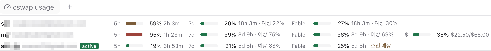
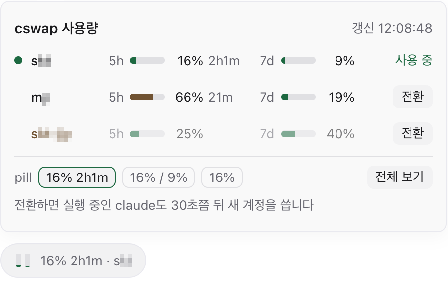

# cswap-usage

[English](README.md)

[claude-swap](https://pypi.org/project/claude-swap/) 계정마다 Claude 사용량을 한 줄씩
보여주는 [Paseo](https://paseo.sh) 워크스페이스 패널. 활성 계정의 사용량을 보여주고 두 번
눌러 계정을 바꾸는 입력창 위 pill도 함께 들어 있다.



## 왜 필요한가

Paseo의 사용량 패널은 프로바이더 ID를 정확히 일치시켜 찾는다. 그래서 `extends: "claude"`로
만든 프로바이더에는 사용량 줄이 아예 뜨지 않는다. 기본으로 들어 있는 `claude` 줄 하나는
자격 증명 파일을 딱 하나만 읽으니, 지금 켜져 있는 계정밖에 보여주지 못한다. claude-swap으로
Claude 계정 여러 개를 돌려 쓰고 있다면 이들을 한눈에 볼 방법이 없는 셈이다.

이 패널은 Paseo가 extends 프로바이더의 사용량까지 물려받을 때까지 그 빈자리를 메운다.

## 요구 사항

- Paseo 0.9.2 이상
- 대상 데몬에서 플러그인 활성화(**Settings → Plugins → Enable plugins**)
- [`claude-swap`](https://pypi.org/project/claude-swap/) 설치, `cswap list --json` 이 정상 동작

## 설치

```bash
paseo plugin add creatorKoo/paseo-cswap-usage
```

로컬 체크아웃에서 설치하려면:

```bash
git clone https://github.com/creatorKoo/paseo-cswap-usage
paseo plugin install "$PWD/paseo-cswap-usage"
paseo plugin ls          # expect: cswap-usage  running
```

## 사용법

**⌘K**(윈도우·리눅스는 **Ctrl+K**) → **Open cswap usage** 로 열거나, New tab 메뉴의
*plugin panels* 에서 연다. 평범한 워크스페이스 패널이라 *Split down* 도 되니, 에이전트 아래에
상태 표시줄처럼 붙여 둘 수 있다.

계정 하나가 표의 한 행이다. 행은 줄바꿈되지 않고, 같은 칩은 어느 행에서든 같은 열에 들어간다:

```
skt   you@example.com [active]   5h    ▮▮▮▮ 100% 16m                  7d    ▮▯▯▯  14% 21h 36m · 예상 16%   Fable ▮▯▯▯  19% 21h 36m              $     ▮▮▯▯  35% $22.50/$65.00
alt   me@example.com             5h    ▮▯▯▯  22% 3h 41m               7d    ▮▯▯▯   6% 4d 02h                                                    $     ▯▯▯▯   4% $2.40/$65.00
team  team@example.com           5h    ▮▮▯▯  48% 2h 05m               7d    ▮▮▯▯  51% 3d 11h · 예상 74%    Fable ▮▮▮▯  63% 3d 11h
```

- **별칭**, **이메일**, 그리고 claude-swap이 지금 쓰고 있는 계정에 붙는 `active` 배지
- 창마다 열 하나씩: `5h`, `7d`, `Fable` 같은 범위별 창, 그리고 맨 뒤에 `$` 지출. 어느 계정에도
  없는 창은 열 자체가 생기지 않는다.
- 셀은 모두 `라벨 · 미니 바 · 퍼센트 · 남은 시간` 구성이고, 폭이 고정이라 열이 세로로 맞는다. 해당
  창이 없는 계정은 그 칸이 빈칸으로 남고, 패널이 표보다 좁으면 가로로 스크롤된다.
- 바 색은 accent에서 시작해 50%에 warning, 90%에 danger로 바뀐다
- 푸터의 **A−** / **A+** 는 글자 크기 세 단계(S/M/L)를 돌린다. 고른 크기는 호스트에
  저장되므로 패널을 다시 열어도 그대로다. 처음에는 S다.
- **새로고침**은 말 그대로 다시 가져오기만 한다. 60초 캐시가 살아 있으면 캐시된 값이 그대로 온다.

`예상 N%`는 **선형** 추정이다. `pct / expectedPct`, 즉 지금의 소모 속도가 창이 끝날 때까지
이어진다고 보고 늘려 잡은 값이다. 이 값이 100%를 넘으면 `소진 예상`으로 바뀐다. 몰아 쓰면
크게 흔들리는 값이니 대략적인 신호 정도로만 보면 된다. claude-swap이 사람에게 보여주는
출력에서 이 추정치를 빼 둔 이유이기도 하다. 창이 초기화되고 24시간쯤은 빈칸인데,
claude-swap이 창이 어느 정도 지나기 전에는 `expectedPct`를 내주지 않기 때문이다.

UI 문구는 시스템 로케일을 따른다(한국어 아니면 영어). 스크린샷은 모두 한국어 로케일 화면이다.

계정 상태가 정상이 아니면 claude-swap이 준 상태(`token_expired`, `relogin_required`,
`keychain_unavailable` 등)를 warning 색으로 보여준다. claude-swap이 그 계정의 마지막 정상
값을 갖고 있으면 칩은 그 값으로 흐리게 그리고, 상태는 별칭 옆 배지로 붙이며,
`마지막 값 HH:MM:SS`로 그 값의 시각을 표시한다. 마지막 값이 없으면 칩 자리에 상태 문자열만
들어간다. 이 상태는 매번 다시 계산할 뿐 디스크에는 쓰지 않는다. 이 플러그인이 claude-swap의
캐시 파일을 읽는 대신 굳이 프로세스를 띄우는 이유가 바로 이것이다.

`token_expired`는 대개 일시적이다. 그 계정으로 `cswap run` 세션이 살아 있으면 claude-swap은
세션을 로그아웃시키지 않으려고 토큰을 건드리지 않는다. 돌고 있는 Claude가 다음 API 호출 때
스스로 갱신하므로, 유휴 세션이면 이 상태가 한동안 유지될 수 있다.

### 입력창 위 pill

기본 `claude` 프로바이더로 실행한 에이전트마다, 채팅 입력창 위에 claude-swap이 지금 쓰고
있는 계정의 pill이 붙는다:


- 아이콘의 막대 두 개는 그 계정의 5h와 7d 창이고, 색은 패널과 같다. 계정 상태가 정상이
  아니면 막대가 흐려지고 warning 색 테두리가 생긴다.
- 라벨은 5h 사용률과 초기화까지 남은 시간, 그리고 맨 뒤에 별칭이다. 별칭이 뒤에 있어서 길면
  별칭 쪽이 `…`로 잘린다. 마우스를 올리면 계정, 두 창의 사용률과 초기화 시간, 상태가 한 줄씩
  나온다.

pill을 누르면 계정마다 한 줄씩 나오는 팝오버가 열리고, 활성이 아닌 계정에는 **전환** 버튼이
있다. 전환은 `cswap switch <번호>`를 실행하므로 이 컴퓨터 전체가 바뀐다. 기본 로그인을 쓰는
실행 중인 claude 에이전트와 터미널이 모두 따라온다(macOS에서는 Claude Code의 Keychain 캐시가
끝나는 30초쯤 뒤). **전체 보기**를 누르면 전체 표가 있는 패널이 열린다.



라벨 형식은 팝오버 아래쪽에서 고른다. 버튼에 그 계정의 실제 값이 미리 보인다.
`42% 2h31m`(기본), `42% / 14%`(5h / 7d), `42%` 중 하나이고, **Settings → Plugins →
cswap usage** 에서도 같은 걸 고를 수 있다.

`claude`를 extends 해서 `cswap run <계정>`으로 실행하는 프로바이더는 그 계정에 고정돼 있다.
그래서 그 에이전트에는 활성 계정 대신 고정된 계정을 보여주는 **고정** pill이 붙는다:

```json
"claude-work": {
  "extends": "claude",
  "command": ["/Users/you/.local/bin/cswap", "run", "work", "--"]
}
```

고정 pill도 읽는 법은 같다. 툴팁에는 `사용 중` 대신 `고정`이 나오고, 팝오버에는 전환 버튼이
없다. `cswap run`으로 고정된 에이전트는 전환해도 계정이 바뀌지 않기 때문이다. 계정은
`cswap run`이 받는 그대로 슬롯 번호, 별칭, 이메일 중 무엇이든 된다. 계정 없이 `cswap run`만
쓰는(디렉터리 매핑) 프로바이더에는 pill이 붙지 않는다.

## 동작 방식

`cswap list --json`이 유일한 사용량 출처다. claude-swap의 상태 파일을 읽지 않고, Anthropic
API를 직접 부르지도 않는다. 상태를 바꾸는 명령은 딱 하나, `cswap switch <번호> --json`뿐이고
pill 팝오버에서 **전환**을 누를 때만 실행한다. `auto`나 번호 없는 `switch`는 실행하지 않는다.

고정 프로바이더를 찾으려고 서버에서 Paseo 자신의 프로바이더 설정(`paseo.config.get()`)을
읽는다. 서버 밖으로 나가는 건 프로바이더 id와 `cswap run` 계정뿐이고, API 키가 들어 있을 수
있는 `env` 같은 나머지 항목은 나가지 않는다.

데몬이 띄운 플러그인 서브프로세스에서 도는 서버 쪽 핸들러는

- **60초** 캐시를 두고 그보다 자주 조회하지 않는다. 사용량 엔드포인트 예산이 아이덴티티당
  시간당 28~30회쯤이고, claude-swap을 쓰는 모든 화면이 이 예산을 나눠 쓴다. 조회가 실제로
  네트워크까지 나가는지는 claude-swap이 정하지 우리가 정하지 않는다.
- **단일 실행(single-flight)** 이다. 동시에 들어온 호출은 서브프로세스 하나를 같이 쓴다.
  두 개가 뜨는 일은 없다.
- **실패해도 이전 값을 유지한다(stale-on-error)**. 호출이 실패하면 직전 스냅샷을 그대로 두고
  오류 줄만 세운다. claude-swap 자신의 동작과 같다.
- 전환은 직전 목록에 있는 계정 번호만 받고, 한 번에 하나만 실행한다. 전환이 끝나면
  `cswap list`를 다시 띄우지 않고 캐시의 활성 계정 표시만 고친다. 패널, 모든 pill, 모든
  팝오버가 조회 하나를 같이 쓰므로 조회 횟수가 늘지 않는다.
- 두 명령의 stdout 모두 절대 로그에 남기지 않는다. 이메일과 조직 이름이 들어 있다.

패널이 그리지 않는 필드(`organizationName`, `organizationUuid`, `projectedExhaustionAt` 등)는
서버 쪽 Zod 스키마에서 걸러내므로 클라이언트까지 아예 넘어가지 않는다.

## 설정

`cswap`은 `~/.local/bin/cswap`에서 찾는다. 데몬의 `PATH`는 사용자 셸의 `PATH`와 다르기 때문에,
이름을 `PATH`로 해석하는 일은 아예 하지 않는다. 다른 경로를 쓰려면 `CSWAP_BIN`에 절대 경로를
넣는다:

```bash
CSWAP_BIN=/opt/homebrew/bin/cswap
```

이 변수는 핸들러가 도는 **Paseo 데몬 프로세스**의 환경에 있어야 한다. 셸에서 export 해 봐야
이미 떠 있는 데몬에는 아무 영향이 없다. 데몬을 띄우는 쪽에 설정하자. macOS라면 Paseo 앱을
다시 켜기 전에 `launchctl setenv CSWAP_BIN <path>`를 실행하거나, 데몬을 실행하는 셸에
넣으면 된다.

## 삭제

```bash
paseo plugin remove cswap-usage
```

`remove`는 플러그인의 설정을 지운다. 디렉터리 소스는 건드리지 않으니 `paseo plugin install`로
넣은 로컬 체크아웃은 그 자리에 남는다. `paseo plugin add`로 설치한 Git 소스라면 관리 중인
체크아웃까지 함께 지운다.

## 개발 메모

```text
index.client.tsx              앱 번들 진입점: 패널, pill, 설정 화면, 커맨드 센터 등록
index.server.ts               데몬 번들 진입점: RPC 핸들러와 설정 문서
client/usage.tsx              패널 본체
client/pill.tsx               pill의 게이지 아이콘, 라벨, 팝오버
client/pill-registration.tsx  claude 에이전트마다 활성 또는 고정 pill을 하나씩 유지
client/settings.tsx           pill 라벨 설정 화면
client/common.ts              패널과 pill이 같이 쓰는 사용량 조회
client/format.ts              라벨·툴팁·계정 찾기 같은 순수 함수(React 없음), 테스트 대상
server/cswap.ts               cswap 실행·캐시·파싱·전환
server/pinned.ts              프로바이더 명령에서 `cswap run <계정>` 찾기
shared/contract.ts            Zod RPC 계약, 양쪽 번들에 모두 들어간다
shared/settings.ts            설정 문서: pill 라벨, 패널 글자 크기
*.test.ts                     vitest, 각자 다루는 모듈 옆에 둔다
```

입력창 pill에서 알아 둘 것:

- pill은 Paseo가 그린다. 한 줄에 폭은 최대 160px이고, 글꼴과 색(흐린 회색)도 Paseo가 정한다.
  플러그인이 정하는 건 라벨 문자열과 16×16 아이콘뿐이라, 자세한 내용은 툴팁과 팝오버에 둔다.
- 라벨은 아이콘 컴포넌트가 맡는다. 사용량 조회와 설정을 구독할 수 있는 건 컴포넌트뿐이라,
  effect 안에서 등록의 `update`로 `{ label, title }`을 밀어 넣는다.
- 좁은 화면에서는 title이 바텀 시트 제목으로도 쓰이므로 그때는 짧게 둔다.

Paseo 플러그인 컴파일러(0.8 이후)에서 놓치기 쉬운 것들:

- 진입점이 **둘**이다. `index.client.tsx`와 `index.server.ts`가 각각 `contribute()`를 기본
  내보내기로 갖는다. 최소 하나는 있어야 하고, 이 플러그인은 둘 다 쓴다.
- **디렉터리가 곧 컴파일 경계다.** `client/`는 앱 번들에만, `server/`는 데몬 번들에만,
  `shared/`는 양쪽에 들어간다. 0.8에서 `*.client.tsx` 같은 파일명 접미사는 아무 의미가 없고,
  리포 루트에 남은 그 밖의 코드 모듈은 컴파일 에러다.
- 클라이언트에서 `server/`를 임포트하거나, 서버에서 `client/`를 임포트하거나, 클라이언트에서
  닿는 `node:` 임포트는 전부 **컴파일 에러**다. 0.7처럼 빈 객체로 스텁 처리되지 않는다.
  그래서 `server/`는 그냥 Node 번들이고, 모듈 최상위에서 `promisify()`나 `homedir()`을 불러도
  된다.
- `shared/`에는 Zod 계약과 평범한 값만 둔다. 앱 번들에도 들어가므로 Node 코드와 React Native
  코드를 섞지 않는다.
- 임포트 경로가 런타임별로 갈린다. `defineRpc`는 `@getpaseo/plugin`, 훅과 클라이언트 기여
  타입은 `@getpaseo/plugin/client`, `PluginServerContext`는 `@getpaseo/plugin/server`.
- `paseo-plugin.json`에 `requirements.paseo`를 반드시 적는다. 이 필드가 없는 매니페스트는
  `<0.8.0`으로 읽혀서 Paseo 0.8이 플러그인 로드를 거부한다.
- 모든 `Text`에는 `theme.colors`의 색을 지정해야 한다. 스타일 없는 텍스트는 검은색이라
  다크 테마에서는 보이지 않는다.

`npm install`을 한 번 돌린 뒤, 소스를 고칠 때마다 `npm run typecheck`, `npm test`,
`paseo plugin reload cswap-usage`를 실행한다. 데몬은 재시작하지 않는다 — 돌고 있는 에이전트가
죽는다.

테스트는 진짜 `cswap`을 절대 실행하지 않는다. `server/cswap.test.ts`가 `execFile`을 가짜로
바꿔 매번 직접 응답하고, 모든 테스트가 cswap 출력이 로그에 새지 않았는지 확인한다. 리포 루트에
코드 모듈을 두면 컴파일 에러라서 vitest 설정 파일은 없고, 기본값으로 테스트를 찾는다.

## 라이선스

MIT — [LICENSE](LICENSE) 참고.
